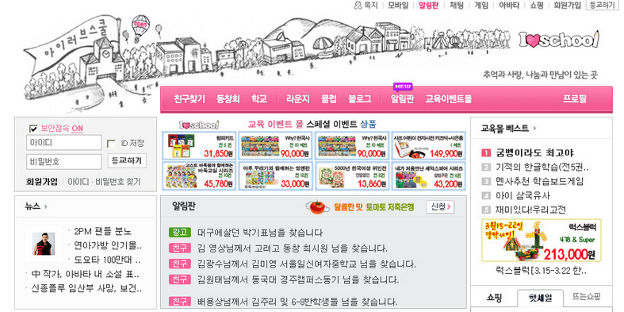

# 라떼 챌린지

### 선택한 서비스: 아이러브스쿨

## 1. 서비스 아이디어 취합

### **1. 아이러브 스쿨**

- 동창찾기 서비스
- 대체 서비스가 너무 많아짐
    - 네이버 밴드
    - 싸이월드

### **2. 버디버디**

- 아바타 기능
- 미니홈피 기능

### **3. HAM 랜덤 소통**

- 아마추어무선
- 장점: 세상의 모든 사람과 전파를 통해 대화를 할 수 있었다.
- 단점1: 장비가 비싼점이 아쉬웠고
- 단점2: 외국인이랑 대화할 경우 의사소통이 어려웠음

### **3. PC 통신**

종류 : 하이텔, 나우누리, 천리안, 유니텔

좋았던 점 :

- 멀리 있는 사람들과 대화를 할 수 있었음
- 새로운 사람들과 만나는 소통의 장이 되었음
- 얼굴도 모르고 약속장소만 정해서 만나는 재미가 있었음

아쉬웠던 점 :

- 연락이 끊긴 사람을 다시 만나기가 힘들었음
- 전화요금 폭탄
- 누군가 전화를 쓰면 사용할 수 없었음(전화망 이용)

사연 :

- 접속 신호가 커서 밤에 몰래 PC통신을 하다가 들켜서 매우 맞게 되는 주 원인을 제공
- 원하는 정보를 얻으려면 게시판 주소로 들어가 게시물 번호를 타이핑
- 전화요금 고지서를 받아보고는 경악
- PC통신을 하던 중에 전화가 안 돼서 혼났다. 또는 PC통신으로 중요한 것을 하던 중에 전화가 오는 바람에 통신이 끊겼다. 이걸 통신장애, 줄여서 '통장'이라고 불렀다.

에뮬레이터 : 이야기, 새롬데이터맨 등등

관련 영화 : 접속

유튜브 : [https://www.youtube.com/watch?v=zcqOJ5dhzJg](https://www.youtube.com/watch?v=zcqOJ5dhzJg)

### **4. 무선호출기 삐삐**

'삐삐' ⇒ 무선통긴기기 or 무선호출기 (pager, beeper) 1980-1990년대
송신불가, 수신만 가능. 많아야 20자 정도의 텍스트 표기 가능
수신자는 공중전화에 가서 발신자에게 전화하는 식으로 사용
초창기에는 광역단체 내에서만 사용 가능했으나 이후 전국에서 가능한 삐삐 출시. 문자메시지도 뜨는 삐삐가 나올 때는 핸드폰이 등장할 시기여서 묻힘.

송신은 안되고 수신만 되는 단방향 통신기기.

최대 20자 정도의 텍스트를 표시할 수 있고, 간단한 버튼 2~3 개가 있다.

수신을 받으면 전화번호나 메시지가 표시된다.

메시지를 수신한 사람은 사용 가능한 전화나  근처 공중전화로 가서 발신자에게 연락

핸드폰으로 치면, '급히 연락바람' 문자와 수신자번호를 함께 보내는 셈

90년대중반부터 많이 사용
당시 밖에 나가있는 사람에게 연락을 할 수 있는 방법이 없었는데, 돌아다닐 일이 많은 세일즈맨과 택시 기사들에게 유용하게 쓰였다고 함.

다양한 삐삐 용어 등장.
ex) 8282(빨리빨리), 1010235(열렬히사모해), 223(둘이서) 등
현재 카페의 진동벨이 삐삐의 후손이라고 함.(삐삐가 망하고 삐삐회사들이 만들어낸 기계)

### 5. 네이버 지식인

길찾기 서비스가 없던 시절에는 지도를 통해서 보아야 하는데, 그 당시에는 이용자수가 얼마 없어서 답변을 받지 못함

### 6. 라이코스

아무래도 포털 사이트를 많이 사용하심, 현재는 검색이 되지 않음

> 투표를 통해 아이러브스쿨로 선택

## 2. 서비스 특징

### 장점
- 동창찾기 서비스
- 당시엔 획기적인 서비스
- 연락하기 힘들었던 동창들을 찾을 수 있다.

### 단점
- 금방 식상해졌다.
- 대체 서비스가 너무 많아짐
    - 네이버 밴드
    - 싸이월드

### 스크린샷

