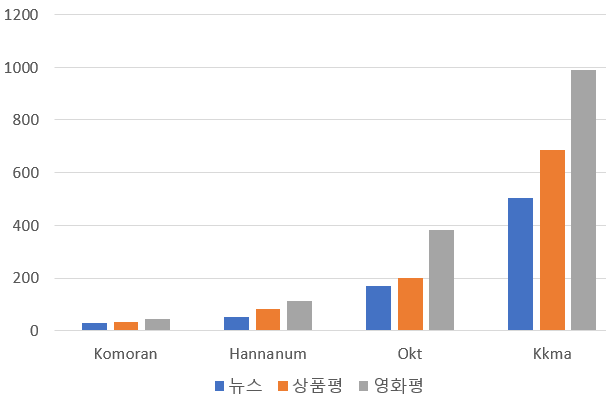

#데이터 전처리

####실행환경
pip install pandas  
pip install konlpy  
pip install tensorflow  
pip install jpype1==0.7.0  

Okt tagger 사용  

####1.긍정 부정
`긍정/부정 학습 data`
필요시 `urllib.request.urlretrieve()`로 reload
https://raw.githubusercontent.com/e9t/nsmc/master/ratings_train.txt
https://raw.githubusercontent.com/e9t/nsmc/master/ratings_test.txt
ratings_train.txt